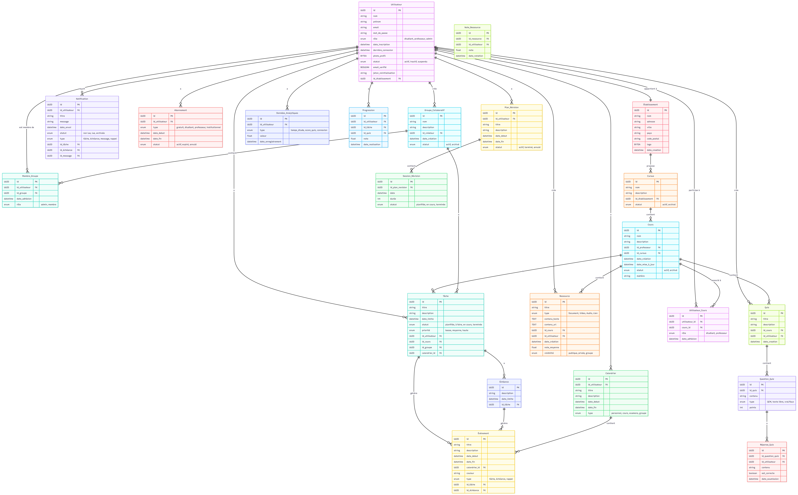
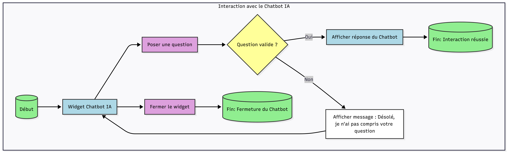
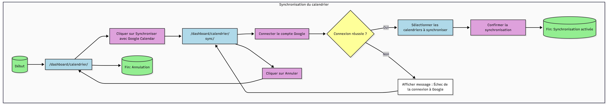
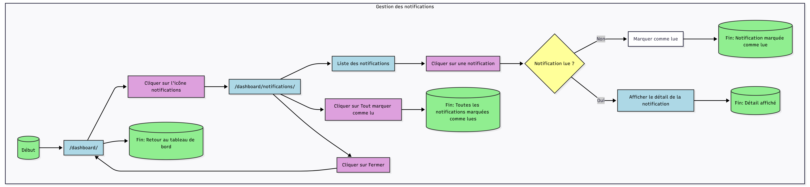

# LearningCampus-Project_B

## Concevoir une application appelée StudyFlow AI
Auteur : Didier Chardonnet - 2026-06

## Projet B

### [Dossier de conception (Document final)](./Projet%20B%20-%20Dossier-de-conception-studyflow-ai.pdf)

### Sequence 0 - Analyser le problème utilisateurt avec l'IA
  
  -  Prompt initial [Voir Doc](./Projet%20B%20-%20Sequence%200.0%20-%20Prompt%20inital.docx.pdf)
  -  Formulaire de conception (IA) [Voir Doc](./Projet%20B%20-%20Sequence%200.1%20-%20Formulaire%20conception.pdf)
  -  Description des fonctionnalités [Voir Doc](./Projet%20B%20-%20Sequence%200.2%20-%20Description%20des%20Fonctionnalit%C3%A9s%20Envisag%C3%A9es.pdf)
  -  Analyse approfondie [Voir Doc](./Projet%20B%20-%20Sequence%200.3%20-%20Analyse%20approfondie.pdf)
    
### Sequence 1 - Identifier les utilisateurs et leurs besoins  
  
  - Prompt Identifier les utilisateurs et leur besoins [Voir Doc](./Projet%20B%20-%20S%C3%A9quence%201.0%20-%20Identifier%20les%20utilisateurs%20et%20leurs%20besoins%20IA.pdf)
  - Analyse des intervenants Personas et groupes [Voir Doc](./Projet%20B%20-%20Sequence%201.1%20-%20Analyse%20des%20Intervenants.pdf)  
  - Prompt de génération du document [Voir Doc](./Projet%20B%20-%20S%C3%A9quence%201.2%20-%20Prompt%20de%20g%C3%A9n%C3%A9ration%20du%20document%20d%E2%80%99analyse.pdf)
  - Document final [Voir Doc](./Projet%20B%20-%20Sequance%201.3%20-%20studyflow-ai-document-de-profils-utilisateurs-1.pdf)

### Sequence 2 - Identifier les fonctionnalités principales 
  
  - Prompt des fonctionnalités principales [Voir Doc](./Projet%20B%20-%20S%C3%A9quence%202.0%20-%20Prompt%20Fonctionnalit%C3%A9s%20principales.pdf)
  - Les Fonctionnalités [Voir Doc](./Projet%20B%20-%20S%C3%A9quence%202.1%20-%20foncitonnalit%C3%A9s.pdf)
  - Le backlogs [Voir Doc](./Projet%20B%20-%20S%C3%A9quence%202.2%20-%20studyflow-ai-backlog-v1-tableau-kanban.xlsx) 

### Sequence 3 - Concevoir l'architecture du produit 

  - Prompts SiteMap, UserFlows, Architecture [Voir doc](Projet%20B-%20S%C3%A9quence%203.0%20-%20Prompts.pdf)
  - Le sitemap [Voir doc](./Projet%20B%20-%20S%C3%A9quence%203.1%20Sitemap.pdf)
  - Les user flows [Voir doc](./Projet%20B%20-%20S%C3%A9quence%203.2%20-%20User%20Flows.pdf)
  - L'Architecture fonctionnelle  [Voir doc](./Projet%20B%20-%20S%C3%A9quence%203.3%20-%20Architecture%20.pdf)
  - La navigation  [Voir doc](./Projet%20B%20-%20S%C3%A9quence%203.4%20-%20Navigation.pdf)
  - L'architecture technique [Voir Doc](Projet%20B-%20S%C3%A9quence%203.5%20-%20Architecture%20technique%20et%20moyens.pdf)
  - Script de création de la base [Voir Doc](Projet%20B%20-%20S%C3%A9quence%203.6%20-%20Script%20de%20cr%C3%A9ation%20de%20la%20base%20de%20donn%C3%A9es.pdf)

### Sequence 4 - Définir les données nécessaires au fonctionnement

-   Prompts [Voir Doc](Projet%20B%20-%20S%C3%A9%204.0%20-%20Prompts.pdf)
-   Vérification des cohérences [Voir Doc](Projet%20B%20-%20S%C3%A9quence%204.3%20-%20V%C3%A9rification%20de%20coh%C3%A9rence.pdf)
-   Croisement des cohérences [Voir Doc](Projet%20B%20-%20S%C3%A9quence%204.4%20-%20Croisement%20de%20coh%C3%A9rence.pdf)
-   Script création de la base (1) [Voir Doc](Projet%20B%20-%20S%C3%A9quence%204.5%20-%20Script%20de%20cr%C3%A9ation%20de%20la%20base%20de%20donn%C3%A9es.pdf)
-   Modèle conceptuel de données [Voir Doc](Projet%20B%20-%20S%C3%A9quence%204.6%20-%20Modele%20conceptuel%20de%20donn%C3%A9es.pdf)
-   Script création de la base (2) [Voir Doc](Projet%20B%20-%20S%C3%A9quence%204.8%20-%20Script%20de%20cr%C3%A9ation%20de%20la%20base%20de%20donn%C3%A9es%20(2).pdf)

### Sequence 5 - Intégration de l'IA dans l'expérience utilisateur

-   Prompts [Voir Doc](Projet%20B%20-%20S%C3%A9quence%205.0%20-%20Prompts.pdf)
-   IA Opportunités [Voir Doc](Projet%20B%20-%20S%C3%A9quence%205.1%20-%20IA%20Opportunit%C3%A9s.pdf)
-   Comparaison Approche [Voir Doc](Projet%20B%20-%20S%C3%A9quence%205.2%20-%20Comparaison%20approche.pdf)
-   Challenge des pertinences [Voir Doc](Projet%20B%20-%20S%C3%A9quence%205.3%20-%20Challenge%20des%20pertinences.pdf)
-   Note de conception [Voir Doc](Projet%20B%20-%20S%C3%A9quence%205.4%20-%20Note%20de%20conception.pdf)

  

## Annexes -

### Modèle conceptuel de données

### Identification 

### Chatbot

### Calendrier

### Tâches

### Ressources

### Notifications

### Administration

    
